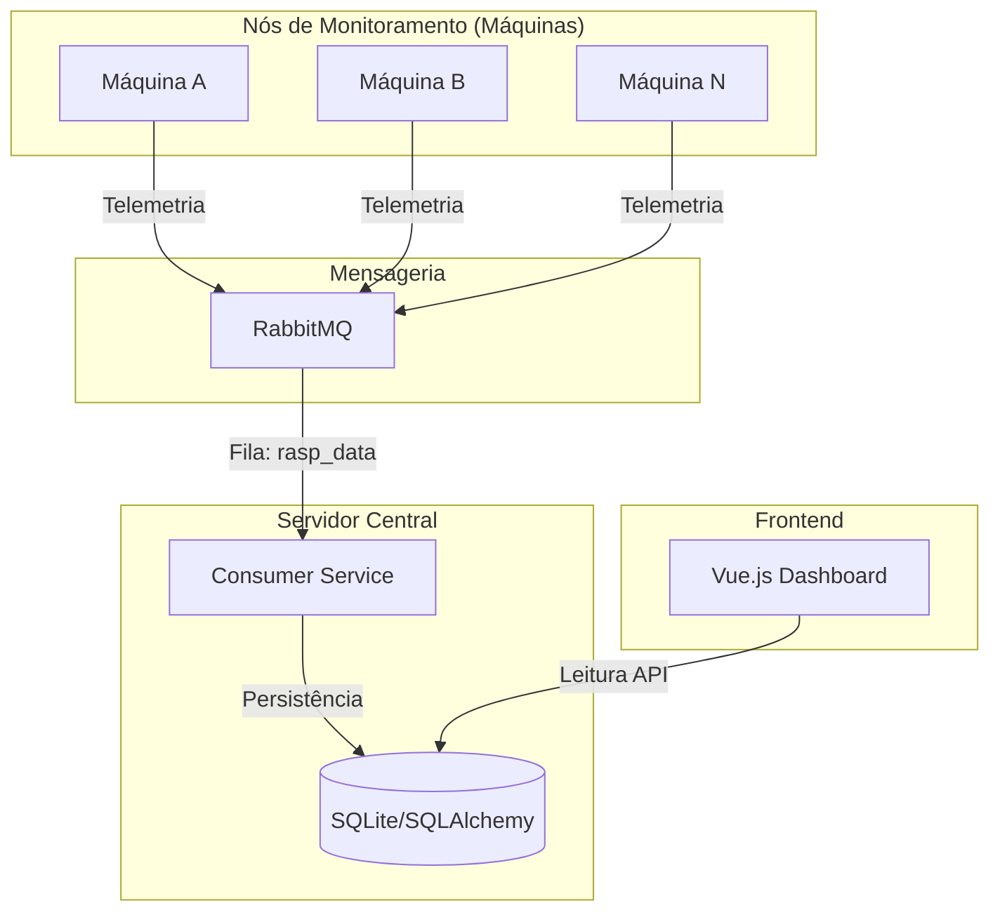

<div align="center">
  <h1>Grieves</h1>
  <p><strong>Sistema de Gerenciamento de Telemetria de Várias Máquinas</strong></p>
  
</div>


Grieves é uma plataforma de monitoramento distribuído projetada para coletar, processar e visualizar métricas de desempenho de múltiplas máquinas em tempo real. Utilizando uma arquitetura baseada em eventos com RabbitMQ, o sistema garante alta disponibilidade e escalabilidade para o monitoramento de frotas de servidores ou dispositivos computacionais.

## Arquitetura

O sistema segue uma arquitetura orientada a eventos, dividida em três camadas principais:



### Componentes Principais

1.  **Server/Publisher (`/server/publisher.py`)**: Script que roda nas máquinas monitoradas.
    *   Coleta métricas de hardware: CPU (Uso, Temp), RAM (Uso), GPU (Uso, Temp) e Tráfego de Rede.
    *   Publica os dados no RabbitMQ de forma eficiente.

2.  **Server/Consumer (`/server/consumer.py`)**: O cérebro do sistema.
    *   Escuta as filas do RabbitMQ, processa as métricas recebidas e atualiza o estado no banco de dados.
    *   Gerencia a persistência utilizando SQLAlchemy.

3.  **Client (`/client`)**: Interface gráfica moderna para visualização.
    *   Dashboard em **Vue 3** + **Vite**.
    *   Monitoramento em tempo real com gráficos de performance e indicadores de status (Online/Offline).

## Estrutura do Projeto

```bash
📦 grieves
├── 📂 client        # Frontend Vue.js (Dashboard administrativo)
├── 📂 docs          # Documentação técnica e assets
├── 📂 server        # Backend (Publishers, Consumers e Banco de Dados)
└── 📄 README.md     # Este arquivo
```

## Como Executar

### Pré-requisitos
*   **RabbitMQ**: Middleware de mensageria.
*   **Python 3.9+**: Para os serviços de backend.
*   **Node.js 18+**: Para o frontend.

### 1. Configurando o RabbitMQ
O sistema utiliza RabbitMQ para comunicação. Certifique-se de que ele está acessível e as credenciais estão corretas no código.

### 2. Rodando o Servidor (Backend)
O servidor gerencia a API e o consumo das métricas.

```bash
cd server
python -m venv .venv
source .venv/bin/activate
pip install -r requirements.txt
uvicorn main:app --host 0.0.0.0 --port 8000 --reload
```

### 3. Rodando o Cliente (Frontend)
Para visualizar o dashboard.

```bash
cd client
npm install
npm run dev
```

### 4. Iniciando a Coleta (Publisher)
Nas máquinas que deseja monitorar:

```bash
cd server
python publisher.py
```

## Documentação Adicional

Para detalhes específicos, consulte a pasta [`/docs`](./docs):
*   [Arquitetura e Fluxo de Dados](./docs/architecture.md)
*   [Modelagem do Banco de Dados](./docs/database.md)

---
*Grieves - Telemetry Management System*
