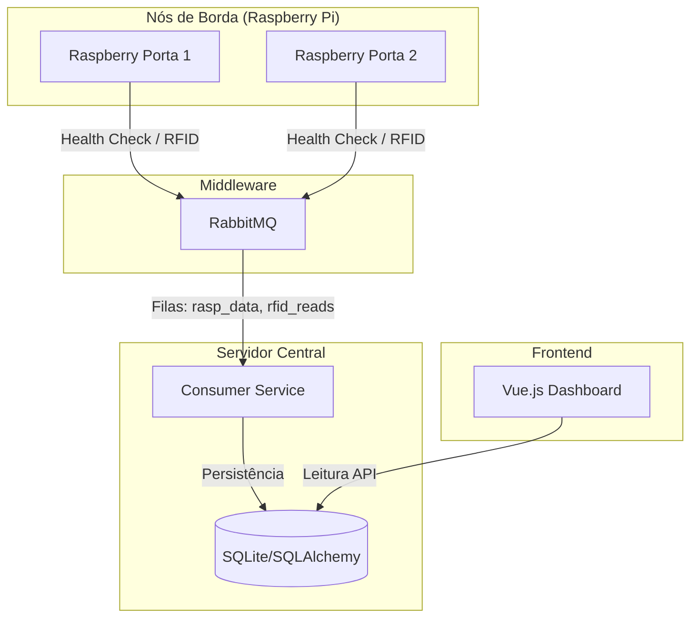

<div align="center">
  
  <h1>Raspberry Gate Cluster</h1>
  <p><strong>Mini-cluster de Controle de Acesso e Monitoramento IoT</strong></p>
</div>


Este projeto implementa uma arquitetura distribuída para controle de acesso e monitoramento de dispositivos utilizando chaves de acesso (RFID) e sensoriamento remoto com Raspberry Pi. O sistema é composto por múltiplos nós de borda (Raspberries) que se comunicam de forma assíncrona com um servidor central através de um broker de mensagens (RabbitMQ), garantindo resiliência e desacoplamento.

## Arquitetura

O sistema segue uma arquitetura orientada a eventos, dividida em três camadas principais:



### Componentes Principais

1.  **Rasp-Nodes (`/rasp-nodes`)**: Código que roda nas placas Raspberry Pi.
    *   Coleta métricas de saúde (CPU, RAM, Temp, Rede).
    *   Gerencia hardware local: Leitor RFID (MFRC522), Display OLED (SSD1306), Botões e LEDs/Atuadores.
    *   Publica mensagens de status e eventos de acesso no RabbitMQ.

2.  **Server (`/server`)**: O cérebro do sistema.
    *   **Consumer (`consumer.py`)**: Escuta as filas do RabbitMQ, processa as mensagens recebidas e atualiza o estado no banco de dados.
    *   **Database (`database.py`)**: Gerencia a persistência de dados utilizando SQLAlchemy (compatível com SQLite, PostgreSQL). Modelos incluem `DeviceStatus`, `RFIDTag`, `RFIDReadHistory`.

3.  **Client (`/client`)**: Interface gráfica para controle e visualização.
    *   Dashboard em **Vue 3** + **TypeScript**.
    *   Visualização em tempo real do status das Raspberries.
    *   (Futuro) Gestão de usuários e permissões de acesso.

## Estrutura do Projeto

```bash
📦 raspberry-gate
├── 📂 client        # Frontend Vue.js (Dashboard administrativo)
├── 📂 docs          # Documentação técnica detalhada
├── 📂 rasp-nodes    # Código fonte para as Raspberry Pi (Publishers)
├── 📂 server        # Backend (Consumers e Banco de Dados)
└── 📄 README.md     # Este arquivo
```

## Como Executar

### Pré-requisitos
*   **RabbitMQ**: Necessário para a troca de mensagens. Deve estar instalado e rodando localmente.
*   **Python 3.9+**: Para o servidor e nós Raspberry.
*   **Node.js 18+**: Para o frontend.

### 1. Subindo o RabbitMQ (Local)
Certifique-se de que o servidor RabbitMQ está instalado e rodando na sua máquina.

Exemplo (Debian/Ubuntu/Raspberry Pi OS):
```bash
sudo apt-get install rabbitmq-server
sudo service rabbitmq-server start
# Habilitar o plugin de gerenciamento (opcional, para acessar http://localhost:15672)
sudo rabbitmq-plugins enable rabbitmq_management
```
O sistema espera as credenciais padrão ou que você configure o `.env` (se aplicável) ou ajuste os arquivos de configuração. No código atual, certifique-se de que o usuário/senha configurados no `server/consumer.py` e `rasp-nodes` coincidem com o seu RabbitMQ local (ex: guest/guest ou athavus/1234).

### 2. Configurando e Rodando o Servidor
O servidor expõe a API para o frontend e consome as mensagens do RabbitMQ (em background).

```bash
cd server
python -m venv .venv
source .venv/bin/activate
pip install -r requirements.txt
# Instale uvicorn se não estiver no requirements
pip install uvicorn
uvicorn main:app --host 0.0.0.0 --port 8000 --reload
```
O servidor iniciará em `http://localhost:8000` e o consumidor RabbitMQ iniciará automaticamente.

### 3. Rodando o Cliente (Frontend)
Para visualizar o dashboard.

```bash
cd client
npm install
npm run dev
```
Acesse em: `http://localhost:5173` (ou porta indicada).

> **Nota:** Atualmente, o cliente pode precisar de uma API intermediária para ler o banco SQLite se não estiver rodando no mesmo contexto (Electron/Local). Verifique a configuração de API no `client/src/services`.

### 4. Configurando um Nó Raspberry
No hardware Raspberry Pi:

```bash
cd rasp-nodes
python -m venv venv
source venv/bin/activate
pip install -r requirements.txt
python main.py
```
*(Consulte `rasp-nodes/README.md` para detalhes específicos de hardware e GPIO).*

## Documentação Estendida

Para detalhes técnicos profundos, consulte a pasta [`/docs`](./docs):
*   [Arquitetura e Fluxo de Dados](./docs/architecture.md)
*   [Modelagem do Banco de Dados](./docs/database.md)
*   [Guia da API e Mensageria](./docs/api.md)

---
*Desenvolvido como parte de projeto embarcados.*
