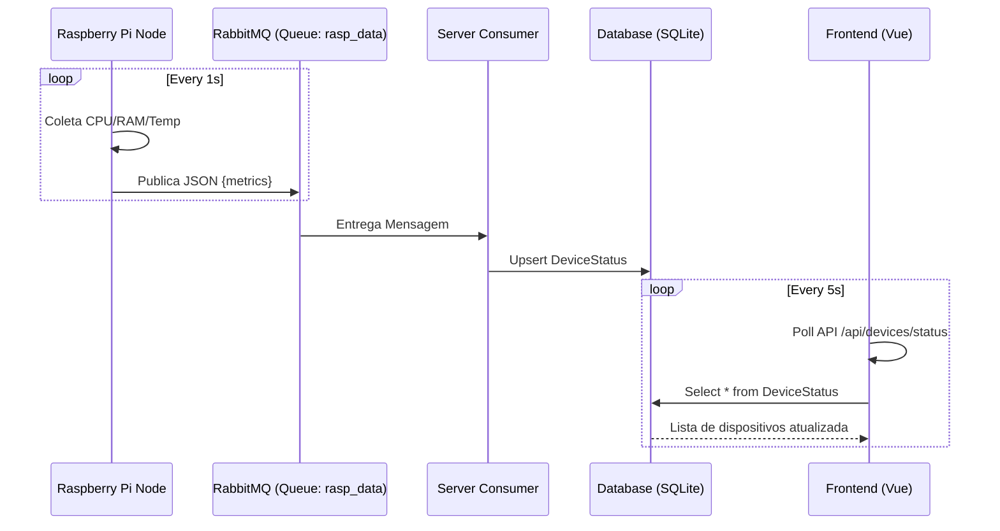
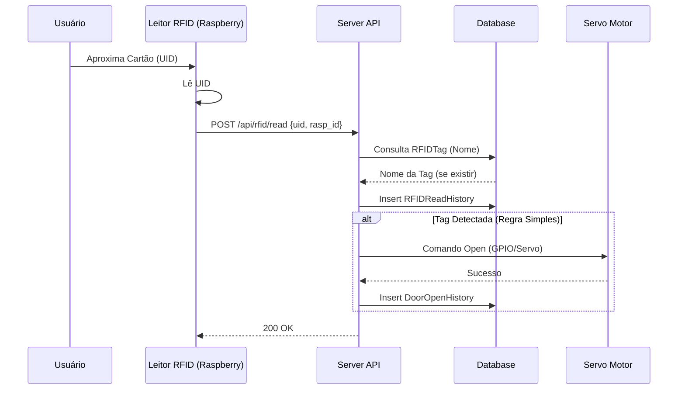

# Arquitetura do Sistema

Este documento descreve o fluxo de dados e os componentes do **Raspberry Gate**.

## Visão Geral

O sistema opera em um modelo **Híbrido (Push/Pull)**:
1.  **Push (Telemetry)**: Os nós Raspberry enviam dados via **RabbitMQ** para o servidor.
2.  **Pull/RPC (API)**: O Frontend consulta o servidor via **HTTP/REST** e envia comandos.

## Diagramas de Sequência

### 1. Fluxo de Health Check (Monitoramento)

### 2. Fluxo de Acesso (RFID)

## Stack Tecnológica

| Camada | Tecnologia | Motivação |
|--------|------------|-----------|
| **Edge** | Python, RPi.GPIO | Acesso fácil ao hardware, rico ecossistema. |
| **Broker** | RabbitMQ | Desacoplamento, buffers para evitar perda de dados se o server cair. |
| **Backend** | FastAPI, SQLAlchemy | Alta performance, assíncrono, validação automática (Pydantic). |
| **DB** | SQLite (Dev) / Postgres | Leve para dev, robusto para prod. |
| **Frontend** | Vue 3, Tailwind | Reatividade moderna, desenvolvimento rápido. |

## Decisões de Design

1.  **API Gateway Unificado**: O `server/main.py` roda tanto a API REST para o cliente quanto a thread do Consumer do RabbitMQ. Isso simplifica o deployment em ambientes pequenos (não precisa de 2 containers separados).
2.  **Identificação por Hostname**: As Raspberries se auto-identificam pelo hostname. Isso facilita a escalabilidade (basta plugar uma nova rasp na rede).
3.  **Histórico Temporal**: Além do status atual, guardamos histórico (`DeviceStatusHistory`) para plotar gráficos de temperatura/uso no futuro.
