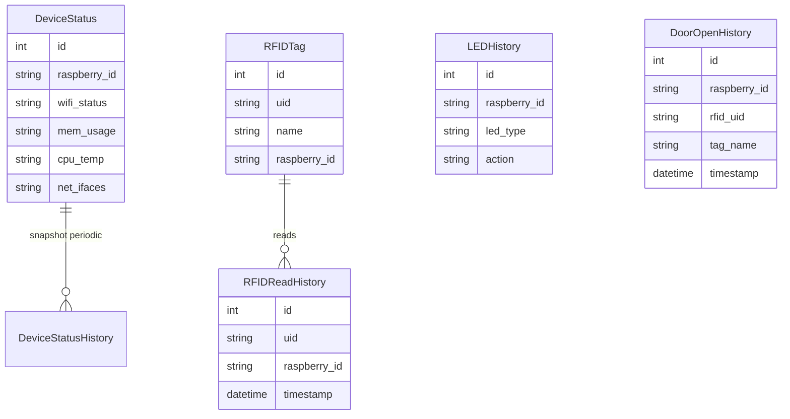

# Documentação do Banco de Dados

O sistema utiliza **SQLAlchemy** (ORM) com **SQLite** por padrão (`raspberry_data.db`), mas é compatível com PostgreSQL ou MySQL.

## Schema ERD (Diagrama Entidade-Relacionamento)



## Modelos

### 1. DeviceStatus (`device_status`)
Armazena o estado *atual* de cada Raspberry Pi. É atualizado a cada *heartbeat* recebido (consumer).

| Campo | Tipo | Descrição |
|-------|------|-----------|
| `id` | Integer | Primary Key |
| `raspberry_id` | String | Identificador Único (Hostname) |
| `wifi_status` | String | SSID ou status |
| `mem_usage` | String | Uso de RAM formatado |
| `cpu_temp` | String | Temperatura da CPU |
| `cpu_percent` | Float | % Uso da CPU |
| `net_ifaces` | JSON (String) | Interfaces de rede IP |
| `last_update` | DateTime | Último heartbeat |
| `last_door_open`| DateTime | Última vez que a porta foi aberta |
| `servo_status` | String | Status da fechadura (open/closed) |

### 2. DeviceStatusHistory (`device_status_history`)
Tabela histórica que guarda snapshots de `DeviceStatus` para análise de tendências temporal (Time Series).

### 3. RFIDTag (`rfid_tags`)
Cadastro de Tags autorizadas/conhecidas.

| Campo | Tipo | Descrição |
|-------|------|-----------|
| `uid` | String | UID da tag (ex: `A3:B9:12:F0`) |
| `name` | String | Nome do usuário (ex: "João Silva") |
| `raspberry_id` | String | Onde foi cadastrado |

### 4. RFIDReadHistory (`rfid_read_history`)
Log de todas as leituras de cartão, sejam autorizadas ou não.

| Campo | Tipo | Descrição |
|-------|------|-----------|
| `uid` | String | UID lido |
| `tag_name` | String | Nome associado no momento da leitura |
| `raspberry_id` | String | Onde foi lido |
| `timestamp` | DateTime | Momento da leitura |

### 5. DoorOpenHistory (`door_open_history`)
Log de aberturas de porta (acionamento do Servo).

| Campo | Tipo | Descrição |
|-------|------|-----------|
| `raspberry_id` | String | Onde a porta abriu |
| `rfid_uid` | String | UID que abriu (ou "manual") |
| `tag_name` | String | Nome do usuário ou "Comando manual" |
| `timestamp` | DateTime | Momento da abertura |

### 6. LEDHistory (`led_history`)
Log de comandos enviados aos LEDs (on/off).

## Inicialização

Para criar as tabelas, execute:
```python
from database import init_db
init_db()
```
O servidor (`main.py`) executa isso automaticamente ao iniciar.